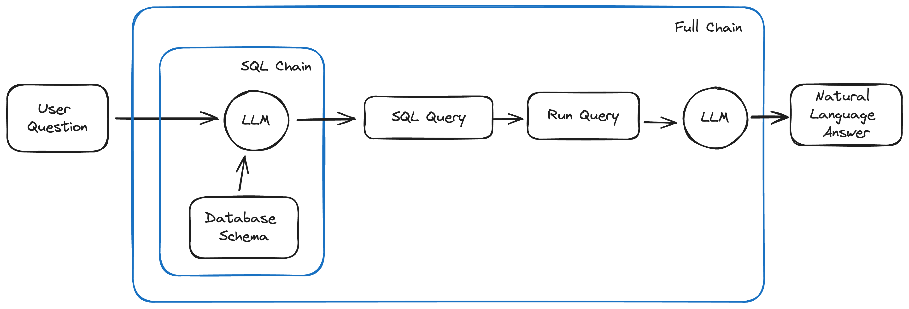

# Chat with MySQL

📋 **Project Overview**  
The **Chat with MySQL** project is a natural language chatbot that interprets user queries, converts them into SQL commands, and fetches results from a MySQL database. Powered by **Llama models from Groq**, this chatbot ensures accurate query interpretation and seamless interaction via a Streamlit-based user interface.

---

💻 **Tech Stack**  
- Python  
- Streamlit  
- MySQL  
- LangChain  
- Groq (Llama Models)  

---

⚙️ **Features**  
- Process natural language queries into SQL commands.  
- Execute SQL commands on a MySQL database and retrieve results.  
- User-friendly chat interface built with Streamlit.  
- Efficient query handling using Groq-powered Llama models.  

---

🛠 **Setup Instructions**  

### Prerequisites  
Ensure you have the following installed:  
- Python 3.8+  
- MySQL database  
- Miniconda or Anaconda (optional but recommended)  

### Installation Steps  
1. Clone the repository:  
   ```bash  
   git clone https://github.com/AttifKhan/Chat-with-MySQL.git  
   cd chat-with-mysql  
   ```

2. Create a virtual environment and activate it:  
   ```bash  
   conda create -n chatmysql python=3.8  
   conda activate chatmysql  
   ```

3. Install the required dependencies:  
   ```bash  
   pip install -r requirements.txt  
   ```

4. Set up your `.env` file in the root directory:  
   ```plaintext  
   GROQ_API_KEY=your-groq-api-key   
   ```

---

### Running the App  
To start the chatbot:  
```bash  
streamlit run src/app.py  
```

---

🧩 **How It Works**  

1. **Natural Language Input**: Users input queries in plain English through the Streamlit chat interface.  
2. **SQL Generation**: The chatbot, powered by Groq’s Llama models, interprets the input and generates the corresponding SQL query.  
3. **Database Interaction**: The SQL query is executed on the connected MySQL database.  
4. **Results Presentation**: Results are formatted and presented back to the user in natural language.

---

🖼 **Workflow Diagram and Interface Snapshot**  

### Workflow Diagram  
  
*This diagram illustrates how the chatbot processes queries from input to database interaction.*  

### Interface Snapshot  
  
*This snapshot displays the Streamlit interface where users interact with the chatbot.*

---

📂 **Project Structure**  
```plaintext  
chat-with-mysql/  
├── docs/  
│   ├── mysql-chains.png  
│   └── interface.png  
├── src/  
│   └── app.py  
├── requirements.txt  
├── .env  
├── .gitignore  
└── README.md  
```

---

🔧 **Customization**  
You can customize the chatbot's behavior by modifying the `src/app.py` file. Adjustments can include fine-tuning SQL query generation logic, enhancing error handling, or adding support for more complex database queries.  

---

🚀 **Future Enhancements**  
- Add support for additional database management systems (e.g., PostgreSQL, SQLite).  
- Enhance the UI with query visualization and result filtering options.  
- Implement user authentication for secure database access.  

---

📄 **License**  
This project is licensed under the MIT License. See the [LICENSE](LICENSE) file for more details.  

---

🙌 **Acknowledgments**  
- **Groq** for providing Llama models for query processing.  
- **LangChain** for conversational logic.  
- **Streamlit** for a simple and effective web application framework.  

---

📞 **Contact**  
For any questions or feedback, feel free to reach out:  
- **Name**: Attif Khan  
- **Email**: [attifkhan634@gmail.com](mailto:attifkhan634@gmail.com)  
- **LinkedIn**: [Attif Khan](https://linkedin.com/in/attif-khan)

